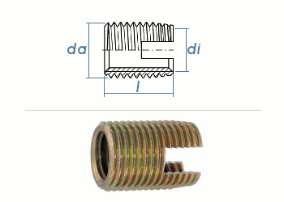

# Parts list

## Overall

| Components |Total (Shipping included)|
| ----     | ----     |
| Sensors|7.650,52€|
| Computers|3.771,75€|
| Mechanical structure|1.978,64€|
| Electrical components|1.246,35€|
| Platform|31.123,66€|
| User interface|276,95€|
| Boards and controllers|199,80€|
| Cover|9.982,33€|
|**Total**   |**56.230€**   |

## Sensors

| Image (Link)    | Name     | Type  | Price   | Quantity | Total (Shipping included)|
| ----     | ----     | ----- | ------- | ----------- |----|
||Velodyne Puck|3D Lidar| 5.840,33€|1|5.840,33€|
||Intel RealSense D435   |RGBD camera   |   205,50€|   2|   411,00€|
|  |MTI-30-Development Kit (MTi-30-2A8G4-DK)|IMU |1330,00€| 1| 1.330,00€|
||ReSpeaker Mic Array v2.0|Digital microphones|69,19€| 1| 69,19€|   
|   |   |   |   |**Total**   |**7.650,52€**   |

## Computers

| Image (Link)    | Name     | Type  | Price   | Quantity | Total (Shipping included)|
| ----     | ----     | ----- | ------- | ----------- |----|
||EVS-1010-MXM1050 Embedded PC |Workstation | 3.626,88€| 1| 3.626,88€|
||NVIDIA Jetson Nano|   | 114,87€| 1| 114,87€|
|   |   |   |   |**Total**   |**3.771,75€** |

## Mechanical structure

| Image (Link)    | Name     | Type  | Price   | Quantity | Total (Shipping included)|
| ----     | ----     | ----- | ------- | ----------- |----|
|          |Item aluminum profiles |       |426,78€ |1 |426,78€ |
|          |Item sliding blocks |       |38,95€ |1|38,95€ |
|          |Aluminum profiles |       |89,90€ |1 |89,90€ |
|          |Item profiles body 30x30 |       |446,79€ |1 |446,79€ |
|          |Item Profile Head |       |263,45€ |1 |263,45€ |
|          |Laser cut parts servos/neck |       |98,77€ |1 |98,77€ |
|          |Alu Profile charging station |       |92,84€ |1 |92,84€ |
|          |Laser parts arm aluminum |       |167,96€ |1 |167,96€ |
|          |Laser/Bending Part Landmark |       |62,47€ |1 |62,47€ |
|          |Laser parts arm ABS |       |82,32€ |1 |82,32€ |
|          |Mechanics arm + interior structure |       |61,47€ |1 |61,47€ |
|          |Flange bearing|       |5,67€ |3 |17,01€ |
||Flange bearing (Flanschlager) |       |18,82€ |4 |75,26€|
||Plexiglas tubes|       |12,83€ |1 |12,83€ |
| |Rectangular tubes|       |8,74€ |1 |8,74€ |
||Thread inserts  |       |33,10€ |1 |33,10€|
|          |          |       |         |**Total**    |**1.978,64€** |

## Electrical components

| Image (Link)    | Name     | Type  | Price   | Quantity | Total (Shipping included)|
| ----     | ----     | ----- | ------- | ----------- |----|
|   |Loudspeaker |       |31,98€ |1 |31,98€ |
||TPA3118 2.1 Amplifier|       |18,89€ |1 |18,89€ |
|          |Loudspeaker/Cable|       |33,49€ |1 |33,49€ |
|          |WiFi Adapter|       |126,14€ |1 |126,14€ |
|          |LED Panel |       |15,16€ |1 |15,16€ |
|          |Actuation ear |       |198,16€ |1 |198,16€ |
|   |BLDC motor, gearbox, encoder|       |411,26€ |2 |822,40€ |
|          |Jack adapter|       |4,90€ |1 |4,90€ |
|          |          |       |         |**Total**    |**1.246,35€** |

## Platform

| Image (Link)    | Name     | Type  | Price   | Quantity | Total (Shipping included)|
| ----     | ----     | ----- | ------- | ----------- |----|
||Mobile Robot MP-500 |       |26.715,50€ |1 |26.715,50€ |
||Sonar Sensors an USBoard for MP-500 |       |1927,80€ |1 |1927,80€ |
||Automatic Charging Station for MP-500 |       |2356,20 € |1 |2356,20€ |
|          |Q-Batteries 12LCP-23 / 12V - 23Ah lead battery cycle type AGM - Deep Cycle VRLA|       |52,17€ |2 |124,16€ |
|          |          |       |         |**Total**    |**31.123,66€** |

## User interface

| Image (Link)    | Name     | Type  | Price   | Quantity | Total (Shipping included)|
| ----     | ----     | ----- | ------- | ----------- |----|
| |Samsung Galaxy Tab A 10.1 SM-T580N |Tablet |178,99€ |1 |178,99€ |
| |Tablet Case + Holder|Waterproof Protective case |97,96€ |1 |97,96€ |
|          |          |       |         |**Total**    |**276,95€** |

## Boards and controllers

| Image (Link)    | Name     | Type  | Price   | Quantity | Total |
| ----     | ----     | ----- | ------- | ----------- |----|
| |Arduino Mega 2560 Rev3 (LED) |       |30,30€ |1 |30,30€ |
| |ODrive v3.6 Motorcontroller |       |169,50€ |1 |169,50€ |
|          |          |       |         |**Total**    |**199,80€** |

## Cover

| Image (Link)    | Name     | Type  | Price   | Quantity | Total (Shipping included)|
| ----     | ----     | ----- | ------- | ----------- |----|
|          |Modellbau Sobi|       |1.335,77€ |1 |1.335,77€ |
|          |Laser cut ABS front|       |59,54€ |1 |59,54€ |
|          |Aluminum for torso|       |616,21€ |1 |616,21€ |
|          |Parts laser internally|       |3.504,55€ |1 |3.504,55€ |
|          |Milling parts|       |4.455,36€ |1 |4.455,36€ |
||Inspection door plastic|       |10,90€|1 |10,90€ |
|          |          |       |         |**Total**    |**9.982,33€** |
