# Loop detection with cmr_lidarloop
<iframe width="560" height="315" src="https://www.youtube.com/embed/Co81uQPXvn8" frameborder="0" allow="autoplay; encrypted-media" allowfullscreen></iframe>

### Introduction
To develop autonomous mobile robots, the solution of the SLAM problem is essential. This describes the requirement to generate a map of the environment while determining the position. Robust methods for static environments have been explored in the past, but such an assumption has little in common with real sensory perception: objects move, seasons affect the appearance of the environment, and images of the same scene differ depending on illumination. Because Sobi's SLAM method RTAB-Map uses primarily visual data, places can rarely be recognized under dynamic lighting conditions. Laser scans are inherently illumination invariant, so more extensive use of this data is appropriate. The ROS package [cmr_lidarloop](https://github.com/MarvinStuede/cmr_lidarloop) has therefore been developed at imes as an extension to RTAB-Map for loop detection using LiDAR data.

The ROS package is presented in a conference paper, which is submitted for publication at AIM 2021. The following presentation builds on the paper and is intended to simplify the use of cmr_lidarloop. It is divided into the following sections:

* [Structure of cmr_lidarloop](#structure-of-cmr_lidarloop)
* [Detector Environment for Training and Testing](#detector-environment-for-training-and-testing)
  * [Detector Data Generation](#detector-data-generation)
  * [Detector Training](#detector-training)
  * [Detector Test](#detector-test)
* [Test Environment for Scan Registration](#test-environment-for-scan-registration)
  * [Registration Visualization](#registration-visualization)
  * [Registration Optimization](#registration-optimization)
* [Single- and Multi-Session Operation with RTAB-Map](#single--and-multi-session-operation-with-rtab-map)

## Structure of cmr_lidarloop

The cmr_lidarloop ROS package has been fully implemented in the RTAB-Map framework for both single session and multi session operation. Figure 1 illustrates this implementation. Accordingly, if a loop is detected, scan registration is performed in a parallel thread. After successful calculation of the transformation, the link can be set in RTAB-Map. RTAB-Map permanently provides cmr_lidarloop with the current data of the map and receives the LiDAR data, which consists of point cloud with associated scan descriptor. For this purpose, cmr_lidarloop processes the point clouds from the laser scanner. In addition, the current inaccuracy of the robot position is updated with the odometry data. A more detailed description of the individual processes can be found in the conference paper. The subject of this section will be the folder structure of the ROS package.

<p align="center">
    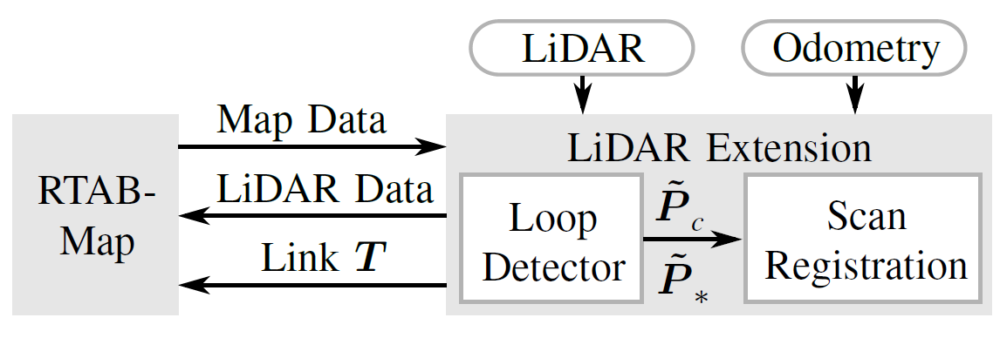
</p>
<p class="text-center"> Figure 1: Extension of RTAB-Map to close loops using LiDAR data.
</p>

The developed LiDAR extension has the characteristic folder structure of a ROS package. In addition, two standalone environments are provided to the user. In one environment the user can train and extensively test the detectors, whereas the other environment is used to validate the scan registration. The structure of cmr_lidarloop is presented below by briefly describing the most important files:

* action
  * LiDAR_Registration.action ⇒ Definition of the message for the registration server
* cfg
  * cmr_lidarloop_params.yaml ⇒ cmr_lidarloop's parameters
* detector
  * test ⇒ Environment for testing detectors
    * plots ⇒ Plots of test results
    * raw_test_data.csv ⇒ Raw test data (robot positions with associated scan descriptors)
    * test_the_detector.py ⇒ Standalone program for testing the loop detectors
  * training ⇒ environment for training detectors
    * plots ⇒ plots of training results
    * functions_for_detector.py ⇒ functions for training and testing detectors
    * functions_for_detector.pyc ⇒ compiled version of functions_for_detector.py
    * LiDAR_Loopdetector.pickle ⇒ **trained loop detector used by cmr_lidarloop**
    * raw_training_data.csv ⇒ raw training data (robot positions with associated scan descriptors)
    * train_the_detector.py ⇒ Standalone program to train the loop detectors
* include/cmr_lidarloop
  * lidar_loopdetection.h ⇒ Header file for loop detection
  * lidar_registration.h ⇒ Header file for scan registration
* launch
  * cmr_lidarloop.launch ⇒ Starts all necessary nodes of cmr_lidarloop
  * save_detector_data.launch ⇒ Starts node to save only data for detector training and test
  * kitti.launch & kitti_odom.launch ⇒ Validation with KITTI dataset
* scripts
  * lidar_loopdetector_server.py ⇒ ROS service to detect a loop
* src
  * Registration_Test ⇒ Environment for validation of scan registration.
    * registration_test.cpp ⇒ Standalone to register two point clouds of a desired loop pair (scans can be stored using lidar_registration_server.cpp while cmr_lidarloop is running)
  * lidar_loopdetection.cpp ⇒ Main node of cmr_lidarloop
  * lidar_registration_server.cpp ⇒ Action server for registration of two point clouds
  * save_data_for_detector.cpp ⇒ Node to save robot positions with associated scan descriptors for the detector environment
* srv
  * LiDAR_Loopdetector.srv ⇒ Definition of the message for loop detector server
* CMakeLists.txt
* package.xml

## Detector Environment for Training and Testing

After the folder structure with all important files of cmr_lidarloop was introduced in the previous section, this and the following section deal with the two standalone environments. These are to be considered as independent, are not executed in the actual operation of cmr_lidarloop and provide the user with important validation tools. In addition, the training of one or more classifiers takes place in the detector environment. The use of this is the subject of the following remarks.

### Detector Data Generation
To train and test a detector, recording data is the first step. This raw data consists of robot positions with associated features of each scan. Since ground truth coordinates of the robot are unfortunately not available, optimized positions from RTAB-Map are used to provide the most accurate data possible for training and testing.

It is useful not to record this detector data directly from Sobi, but instead to first record ROSbags of the topics required for RTAB-Map. This has the advantage that one can later vary the parameters when calculating the scan descriptors and thus have different detector data of the same environment available depending on the parameter selection. The parameter *r_max* of the maximum range significantly influences the feature vectors and can be adjusted directly in the parameters of cmr_lidarloop. Other parameters like e.g. the bin size of the range histograms can be changed in lidar_loopdetection.h, because in this header file the calculation of the features of the point cloud is implemented. To record a ROSbag with Sobi with all necessary topics, the following commands must be executed one after the other in different *tmux* windows on Sobi:

1. roscore
2. roslaunch cmr_driver sensor_model_full.launch ⇒ Start sensors
3. rosrun teleop_twist_keyboard teleop_twist_keyboard.py ⇒ Sobi remote control with keyboard
4. roslaunch cmr_localization bag_record.launch ⇒ Recording of a ROSbag

Sobi can then be run in the desired environment and a ROSbag recorded. Once this is complete, the individual processes can be terminated using *ctrl+c* and the ROSbag can be moved to an external hard disk. On the own laptop the detector data can be generated in a next step with this recording of the topics. To do this, the following commands must be executed one after the other in different terminal windows:

1. roscore
2. roslaunch cmr_lidarloop save_detector_data.launch ⇒ Start Node to save detector data (**Wait until**: [INFO][..]: Please start RTAB-Map.)
3. roslaunch cmr_localization rtabmap_offline.launch oder roslaunch cmr_localization rtabmap_offline.launch long_range:=true ⇒ Start RTAB map with desired sensor configuration (**Wait until**: [INFO][..]: rtabmap #.##.# started...)
4. roslaunch cmr_localization bag_play.launch file:=/path/to/bagfile.bag ⇒ Playing the ROSbag

Once the ROSbag has been completely played, *ctrl+c* can be used to terminate all processes, and the detector data (\~/.ros/raw_detector_data.csv) will be saved automatically. These consist, as already mentioned, of robot positions with associated scan descriptors of the point clouds. Table 1 shows the basic structure of the generated detector data for an exemplary parameter set. The first line gives information about the dimension of each descriptor. The number of type I features is 32 in each case, whereas the number of type II features may vary depending on the choice of parameters used to calculate the features. In this example, the nine range histograms have the lengths given in the first line. These lengths are important during training and testing for correct data processing. The rest of the document consists of the xyz coordinates of the robot with associated features for n nodes. In this case, each high-dimensional point cloud (\~45,000 points) is described with 843 real numbers.

| Lengths of feature vector: | 32  |  400 |  160 | 80 | 54 | 40 | 27 |   20   |   16   |   14   |||
|:--------------------------:|:---:|:---:|:----:|:----:|:----:|:--:|:--:|:--:|:--:|:------:|:------:|:------:|
|              x             |  y  |  z  |  f1  |  f2  |  f3  |  … |  … |  … |  … |  f841  |  f842  |  f843  |
|             x_1            | y_1 | z_1 | f1_1 | f2_1 | f3_1 |  … |  … |  … |  … | f841_1 | f842_1 | f843_1 |
|             x_2            | y_2 | z_2 | f1_2 | f2_2 | f3_2 |  … |  … |  … |  … | f841_2 | f842_2 | f843_2 |
|              :             |  :  |  :  |   :  |   :  |   :  |  … |  … |  … |  … |    :   |    :   |    :   |
|             x_n            | y_n | z_n | f1_n | f2_n | f3_n |  … |  … |  … |  … | f841_n | f842_n | f843_n |

<p class="text-center"> Table 1: Basic structure of the generated detector data for an exemplary parameter set. The first line contains the number of type I and type II features. The remaining data consists of robot positions with associated features of the respective point clouds.
</p>

### Detector Training
Once the detector data has been successfully generated, it can be used to either train new loop detectors or test existing classifiers. Detector training is the subject of this section, for which the generated detector data (\~/.ros/raw_detector_data.csv) must be moved to the cmr_lidarloop training environment (detector/training). The training script can then be started from the terminal using
```
$ python train_the_detector.py raw_detector_data.csv
```
If the detector data has been renamed to raw_training_data.csv, the command
```
$ python train_the_detector.py
```
will suffice. The user can influence the training with the following parameters, which can be varied in the training script:

* float loop_closure_distance ⇒ Distance in m for which the classifier should detect a loop. All pairs with smaller distance are positive pairs (loop pairs) and all others are negative pairs
* int n_max_points ⇒ Maximum number of nodes from the detector data which will be used for training. If there are too many detector data (number of nodes consisting of positions with associated descriptors), a random subset is generated. For n_max_points<0 all detector data are used. The user can use this to perform downsampling, which is illustrated in Figure 2. From the exemplary data set with 1248 nodes only 500 nodes are used for training, which are chosen randomly
* float pos_neg_ratio ⇒ ratio of positive and negative data pairs. From the exemplary training data set with 1248 nodes, 779,376 possible pairs can be formed. Here, each node is compared with itself and with all others, so that this number of pairs is possible. For example, loop_closure_distance=3 results in a training set with 11,458 positive pairs and 767,918 negative pairs, which is unbalanced. Choosing for example pos_neg_ratio=1 results in 11,458 randomly selected negative pairs and the number of positive and negative pairs would be identical during training
* int n_detectors ⇒ number of detectors to be trained. Since the training data is unbalanced with respect to positive and negative pairs, only a small subset of the training data is used in the balanced set. In the example of the previous bullet point, the training data set consists of only 22,916 points, although 779,376 pairs are available. Depending on randomly generated training data, the performance of each detector may vary, so training multiple detectors with different subsets of the training data is possible
* bool create_AdaBoost_csv ⇒ Store the training data used
* bool execute_cv, int n_folds, int n_cross_validations ⇒ Perform n_fold cross validation with training data used. This is executed n_cross_validations repeatedly, with the folds varying in each repetition
* float loop_probability_start, float loop_probability_inc ⇒ For ROC (Robot Operating Curve) generation, the minimum loop probability can be varied, since this threshold decides what minimum loop probability must be present to classify the pair as positive. Starting at loop_probability_start with an increment of loop_probability_inc, the respective results of the repetitive cross-validations can accordingly be averaged and the ROC plotted for the training data used and the trained detector. Figure 3 shows an exemplary ROC, where the termination criterion was met at an error rate (FA) smaller than 1%. The course is characteristic, since with decreasing error rate of the detector at the same time fewer loops are detected and thus the detection rate (D) also decreases

<p align="center">
    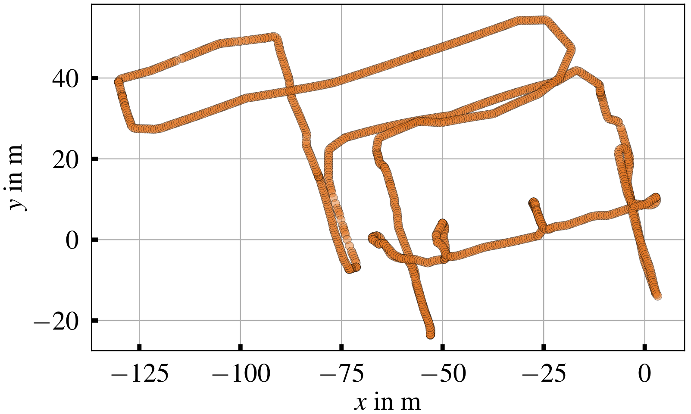
    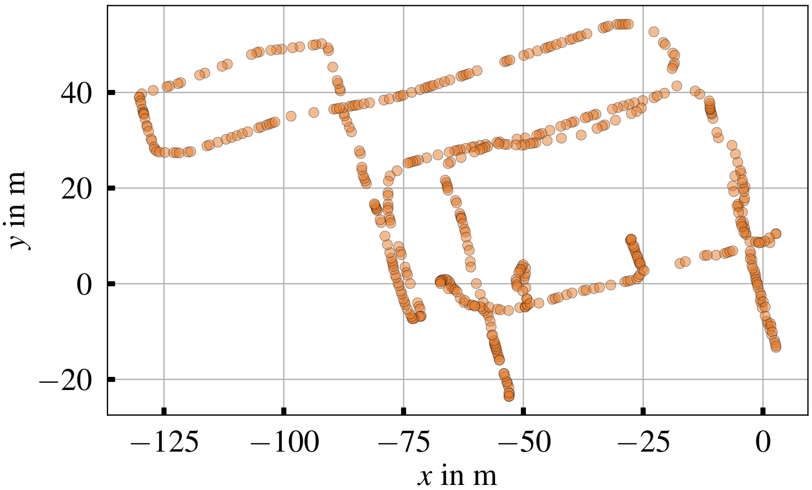
</p>
<p class="text-center"> Figure 2: Positions of the nodes used for training for an exemplary training data set with 1248 nodes (upper visualization). If the user wants to downsample, for example to use only 500 nodes for training, a random subset is generated (lower visualization).
</p>

<p align="center">
    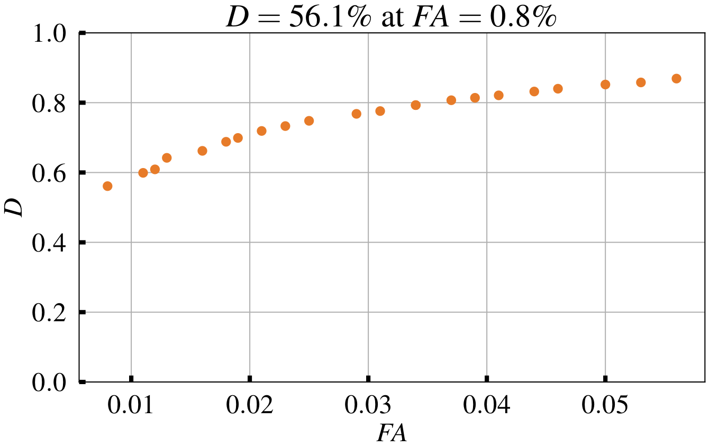
</p>
<p class="text-center"> Figure 3: Exemplary ROC by averaging the results of repeated k-fold cross validation and incrementally increasing the minimum loop probability. The termination criterion is fulfilled at an error rate smaller than 1% (FA<1%).
</p>

### Detector Test

As described in the previous section, validation with the training data can take place during training. There, although the test data is completely decoupled from the training data in each run, it still comes from the same environment. To validate the generalization of the trained detector, it would therefore be interesting to see how it performs in a completely unknown environment that was not run when the training data was generated. This is also possible in the detector environment after one or more detectors have been trained. To do this, the generated detector data (~/.ros/raw_detector_data.csv) must be moved to the test environment of cmr_lidarloop (detector/test). The test script can then be started from the terminal using
```
$ python test_the_detector.py raw_detector_data.csv
```
If the detector data has been unnamed to raw_test_data.csv, the command
```
$ python test_the_detector.py
```
will suffice. The user can influence the test with the following parameters, which can be varied in the test script:

* float loop_closure_distance ⇒ see above
* int n_max_points ⇒ Maximum number of nodes from the detector data that will be used for testing. If there are too many detector data, a random subset is generated. For n_max_points<0 all detector data will be used
* float loop_probability_min ⇒ Minimum loop probability. Is the most important parameter, as it can be used to fine-tune the performance of the detector. The goal should be an error rate (FA) as low as possible while maintaining a high detection rate (D)
* int[] numbers_detector ⇒ Numbers of the detectors to be tested. For example, for numbers_detector=np.array([1,2]) the two trained detectors detector/training/LiDAR_Loopdetector1.pickle and detector/training/LiDAR_Loopdetector2.pickle are tested and compared. The testing of several detectors is useful if, due to the problem of varying detector performance with random generation of the training data explained above, an optimization is to be performed. Figure 4 shows the result of an optimization with 50 trained detectors. Depending on the underlying training set, which is a random subset of all training data, the detector performance varies strongly for an exemplary test data set. The best detector LiDAR_Loopdetector46.pickle can therefore be used by cmr_lidarloop, for which it must be renamed to LiDAR_Loopdetector.pickle
* bool compute_ROC, float loop_prob_start, float loop_prob_inc, float fa_goal ⇒ ROC computation starting at loop_prob_start with increment loop_prob_inc and termination criterion FA<fa_goal. Figure 5 shows an exemplary test result. Besides the general ROC plot, which was generated by incrementally increasing the minimum loop probability, the operating point of the detector set with loop_probability_min (blue star) is marked in the curve. Furthermore, the classification matrix (prediction of the detector) can be compared with the distance matrix (underlying ground truth)

<p align="center">
    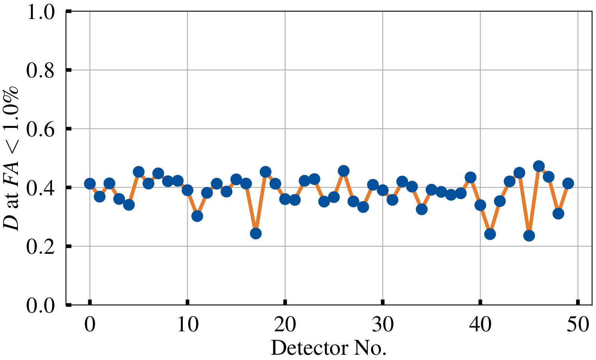
</p>
<p class="text-center">
    Figure 4: Result of the detector optimization. Because the training data are partly randomly selected, the performance of the detectors varies.
</p>

<p align="center">
    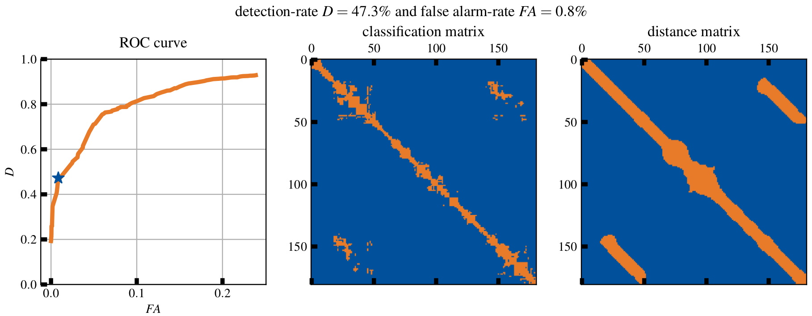
</p>
<p class="text-center">
    Figure 5: Exemplary test result for a trained detector for a test data set consisting of ROC, classification matrix and distance matrix.
</p>

## Test Environment for Scan Registration

As a second independent environment of cmr_lidarloop a comprehensive validation of the used scan registration (src/Registration_Test) is available to the user. In the actual cmr_lidarloop operation there is the possibility that all point clouds of added loop pairs are saved (see cmr_lidarloop_params.yaml). If the registration should be executed again afterwards to visualize the registration or to optimize registration parameters, this can be done with:
```
$ ./registration_test.cpp <PATH_FOLDER> <ID_CLOUD_1> <ID_CLOUD_2> <SKY_DIRECTION>
```
As input parameters, this script only needs the two Ids of the loop pair to be examined, since these are the names of the point cloud files (.pcd). Additionally, the path to the folder where the scans were saved and the sky_direction (see cmr_lidarloop_params.yaml) is required.

### Registration Visualization

Executing the code will run the scan registration with the default parameters of cmr_lidarloop. The start of the registration with the two point clouds unaligned to each other (Figure 6), the result of the initial alignment and thus the rough registration (Figure 7) or the result of the final registration using Iterative Closest Point and initial guess from the rough registration (Figure 8) can be visualized.

<p align="center">
    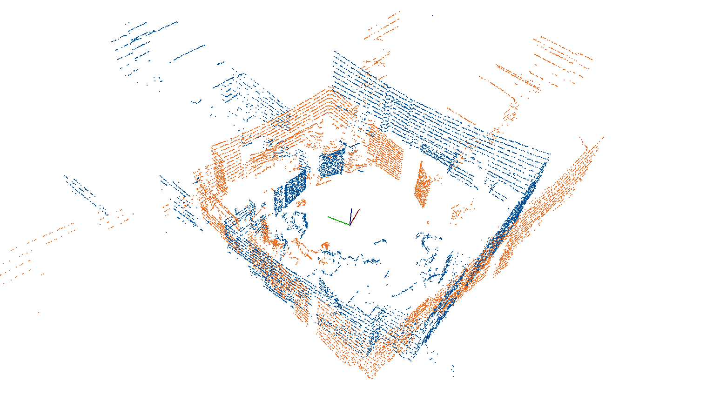
</p>
<p class="text-center">
    Figure 6: Two point clouds are unaligned to each other and are to be registered with each other.
</p>

<p align="center">
    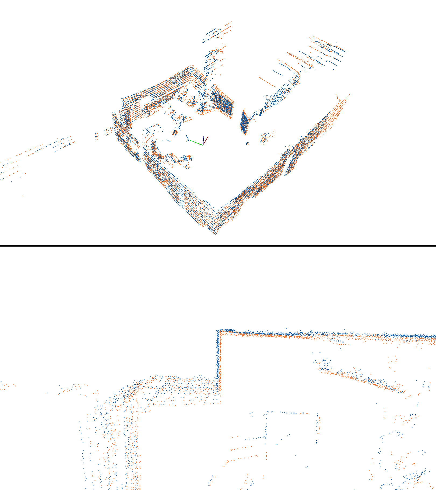
</p>
<p class="text-center">
    Figure 7: After a global registration, the two point clouds are roughly aligned with each other.
</p>

<p align="center">
    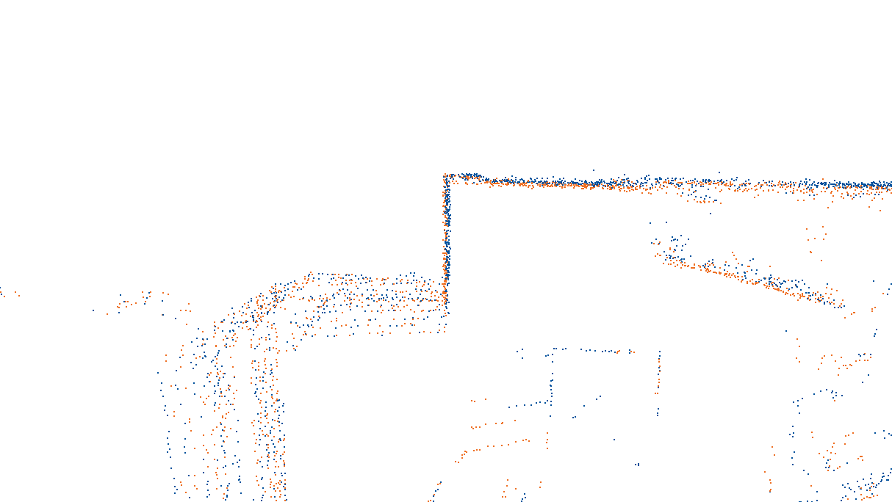
</p>
<p class="text-center">
    Figure 8: With the result of the global registration as initial guess, a local registration is performed for refinement.
</p>

### Registration Optimization

The registration of two point clouds can be challenging e.g. in the presence of many glass fronts. These reflect the laser beams, so that the generated point clouds have little in common with reality. Therefore, to increase robustness, various filters are applied to the raw high-dimensional point cloud - of course, also for dimensionality reduction to perform registration as fast as possible. If one wants to implement further filters, the scan environment is a good choice to test the filter for selected pairs first before implementing it in cmr_lidarloop.

Furthermore, the registration parameters of cmr_lidarloop can be optimized. The setting of these parameters significantly influences the registration, so that an unfavorable choice significantly reduces the performance and, in the worst case, the map generated by RTAB-Map is unrealistic due to incorrect transformation matrices. Accordingly, changing the parameters should only be done after sufficient testing. The functions used are defined in lidar_registration.h:

```
void initial_alignment(PointCloud<PointXYZI>::Ptr input_cloud,
                       PointCloud<PointXYZI>::Ptr target_cloud,
                       double &fitness_score,
                       Eigen::Matrix4f &transformation_ia,
                       int &n_inliers,
                       bool visualize_normals=false,
                       bool visualize_corr=false,
                       int k_normals=100,
                       std::vector<float> radii_features={1.,1.25},
                       float alpha=.6,
                       float inlier_threshold=2.,
                       int nr_iterations =300)

void icp_registration(pcl::PointCloud<pcl::PointXYZI>::Ptr input_cloud_ptr,
                      pcl::PointCloud<pcl::PointXYZI>::Ptr target_cloud_ptr,
                      pcl::PointCloud<pcl::PointXYZI>::Ptr output_cloud_ptr,
                      Eigen::Matrix4f initial_guess,
                      Eigen::Matrix4f &transformation_icp,
                      double &fitness_score,
                      float t_epsilon=1e-6,
                      float max_correspondence=1,
                      int max_iterations=50,
                      float outlier_threshold=0.05)
````

Before changing the parameters in the header file and then using them in the operation of cmr_lidarloop, one can vary them in the standalone environment when calling the function. For example, you could add the following to the code line for rough registration:

`initial_alignment(current_cloud,target_cloud,fitness_score_ia,transformation_ia,n_inliers,false,false,200);
`

If you run the standalone, the desired registration is visualized with k_normals=200 instead of k_normals=100. This parameter defines the number of nearest neighbors, which are considered in the calculation of the normal vectors. If you set visualize_normals=true, these normal vectors are additionally displayed in each point cloud. Depending on the number of nearest neighbors, different vectors result, so that an unfavorable choice (Figure 9 left) significantly reduces the quality of the global registration. A reasonable choice (Figure 9 right) is thus essential for an acceptable rough alignment of both scans.

<p align="center">
    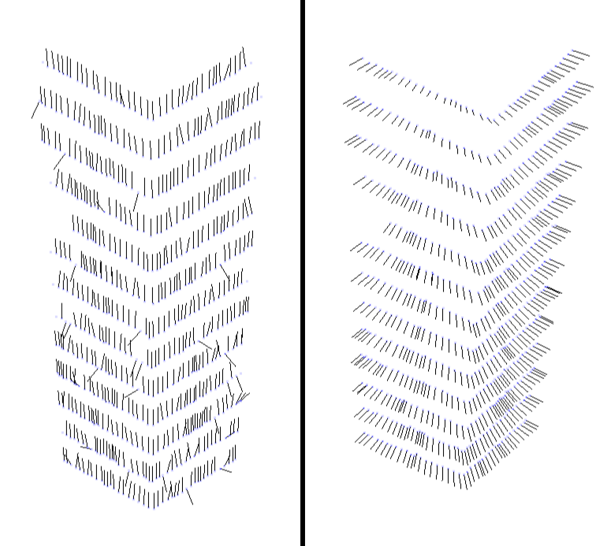
</p>
<p class="text-center">
    Figure 9: Normal vectors for unfavorable (left) and target-oriented (right) choice of the parameter k_normals.
</p>

It is also possible that the filtered correspondences (inliers) are visualized. These are the matches of the two point clouds detected by the algorithm after incorrect correspondences (outliers) have been discarded. With visualize_corr=true this process can be visualized. First, all found correspondences between the keypoints of the two scans are visualized, which is illustrated in Figure 10 for two exemplary outdoor scans. Since the correspondences are determined based on the features used (Fast Point Feature Histograms) by searching for the nearest neighbor in the feature space, a correspondence exists for each keypoint in the point cloud to be registered (source cloud) with a keypoint in the second point cloud (target cloud). Since many of these generated correspondences are erroneous, e.g. because areas of many keypoints of the source cloud cannot be found in the target cloud due to incomplete overlapping of the scans, a large part of the found correspondences is rejected. Figure 11 shows the filtered correspondences for the two exemplary scans. The outlier rejection using RANSAC (RANdom SAmple Consensus) is thus an important step, since erroneous correspondences are discarded and inliers remain between similar structures such as pillars or trees. Finally, for the sake of completeness, the result of the global registration of the two outdoor scans is presented in Figure 12. Although the outdoor scans have significantly less meaningful scan areas compared to the indoor environment above, the global registration is successful with the approach used and can subsequently be further refined with the local method.

<p align="center">
    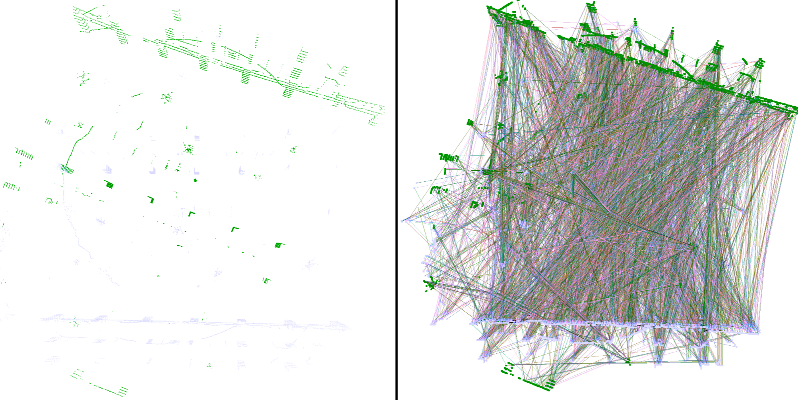
</p>
<p class="text-center">
    Figure 10: Start of registration with two unaligned outdoor scans (left) and all correspondences before outlier rejection (right).
</p>

<p align="center">
    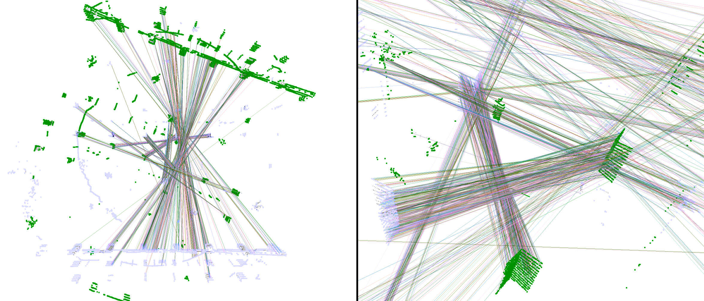
</p>
<p class="text-center">
    Figure 11: All correspondences after outlier rejection (left) and selection of some inliers (right).
</p>

<p align="center">
    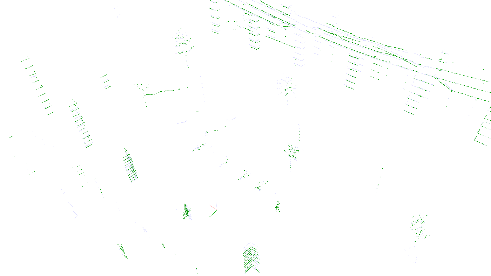
</p>
<p class="text-center">
    Figure 12: Final result of the global registration of two outdoor scans.
</p>

With the introduced registration environment, the user is thus provided with a tool for iterative parameter tuning for challenging registration tasks, in addition to a possible visualization of the registration of selected scan pairs. Optimization requires a comprehensive understanding of the individual parameters, which are introduced in detail in the publications cited in the conference paper. In particular, the publication on registration using the Point Cloud Library (_Holz: Registration with the Point Cloud Library - A Modular Framework for Aligning in 3-D_) is recommended, as it presents the individual concepts of global and local registration with code examples in detail. In cmr_lidarloop, scan registration was implemented using the Point Cloud Library, so this publication offers the perfect introduction.

## Single- and Multi-Session Operation with RTAB-Map

Finally, after presenting the structure and the two standalone environments of cmr_lidarloop, the actual operation of the ROS package will be described. As mentioned earlier, cmr_lidarloop is fully implemented in the RTAB-Map framework: in both single-session and multi-session operation, LiDAR data is used in both mapping and localization modes of RTAB-Map to close loops. The mode is automatically adopted from RTAB-Map and does not need to be specified at startup. Thus, if a database exists (~/.ros/rtabmap.db), cmr_lidarloop reads the data from the old session, adopts the mode of RTAB-Map (mapping vs. localization), and the size of the short term memory (STM). If the user wants to play a recorded ROSbag to simulate the operation, the following commands have to be executed in different terminal windows:

1. roscore
2. roslaunch cmr_lidarloop cmr_lidarloop.launch ⇒ Start cmr_lidarloop with all necessary nodes (**Wait until**: [INFO][..]: Please start RTAB-Map.)
3. roslaunch cmr_localization rtabmap_offline.launch or roslaunch cmr_localization rtabmap_offline.launch long_range:=true ⇒ Start RTAB map with desired sensor configuration (**Wait until**: [INFO][..]: rtabmap #.##.# started...) ⇒ Depending on the mode, outputs appear in the terminal of cmr_lidarloop such as: [INFO][..]: STM_size: 40, MappingMode: true [INFO][..]: Adding 1057 nodes to LiDAR memory from rtabmap.db. Multi session operation switched on. [INFO][..]: Subscribed to /rtabmap/mapData and /rtabmap/info **or** [INFO][..]: STM_size: 40, MappingMode: true [INFO][..]: No database is used. Multi session operation switched off. [INFO][..]: Subscribed to /rtabmap/mapData and /rtabmap/info
4. roslaunch cmr_localization bag_play.launch file:=/path/to/bagfile.bag ⇒ Playing the ROSbag

As usual, all processes can be terminated with *ctrl+c* at the end. The RTAB-Map database (\~/.ros/rtabmap.db) is automatically saved, which also contains the LiDAR data required by cmr_lidarloop for all nodes. These are therefore automatically read in again when a new session is started with the existing database. In addition, cmr_lidarloop saves selected data on exit (\~/.ros/cmr_lidarloop_history.csv). So far, only the time history of the variable search radius and the Ids of accepted loop pairs are stored there.

Analogous to the above commands for simulation using ROSbag, cmr_lidarloop can also be used directly in the operation of the robot. To do this, the following commands must be executed in different *tmux* windows:

1. roscore
2. roslaunch cmr_driver sensor_model_full.launch ⇒ Start sensors
3. rosrun teleop_twist_keyboard teleop_twist_keyboard.py ⇒ Sobi remote control with keyboard
4. roslaunch cmr_lidarloop cmr_lidarloop.launch ⇒ Start *cmr_lidarloop* with all necessary nodes (**Wait until**: [INFO][..]: Please start RTAB-Map.)
5. roslaunch cmr_localization rtabmap.launch **or** roslaunch cmr_localization rtabmap.launch long_range:=true ⇒ Start RTAB map with desired sensor configuration (**wait until**: [INFO][..]: rtabmap #.##.# started...).

As usual, all processes can be terminated by pressing *ctrl+c*, whereby the data from cmr_lidarloop and RTAB-Map's database are also automatically saved. RTAB-Map's Database Viewer
```
$ rtabmap-databaseViewer rtabmap.db
```
is generally suitable for viewing these results. Using View⇒Graph View, the generated map can be visualised, whereby all loop closures are also visualised. By selecting View⇒Constraints View, a visualisation of the individual loop pairs is possible, which is ideal for examining the added loops. If you move the slider at loop closure to the left, the loops closed by cmr_lidarloop (*4-user link*) are shown in addition to the loop closures of RTAB-Map (*1-loop closure, 2-space proximity link*). Here, the registration of the two scans is particularly interesting, as an incorrectly calculated transformation matrix can be recognized directly by incorrect alignment of the point clouds. In this case, the registration of the scan pair could be visualised again in the registration environment and a successful registration could be realised by parameter tuning. The display of the associated RGBD images also provides information whether the loop was detected correctly or incorrectly.

Finally, it should be mentioned that the user has the possibility to adjust the most important parameters of cmr_lidarloop. For this purpose, the values in the parameter file (cfg/cmr_lidarloop_params.yaml) can be changed before starting the programm. A detailed description of the parameters is also available in this file.

### Citing
If you use this software for your research, please cite the following publication:
```
Have I been here before? Learning to Close the Loop with LiDAR Data in Graph-Based SLAM
Habich, T.-L., Stuede, M., Labbé, M., Spindeldreier, S.
IEEE/ASME International Conference on Advanced Intelligent Mechatronics (AIM) 2021
```
